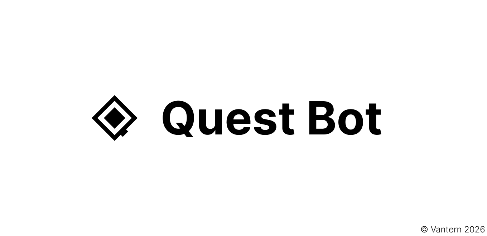

  

---

  
  

# Features

Quest Bot is an opensource modern Discord Bot built for moderation, utilities and support!

Quest Bot is capable of:
- All moderation commands such as: /ban, /kick, /mute, /warn, /purge, /slowmode & /lockdown.
- Automod, with scam protection and a honeypot channel to catch spam bots.
- Autoroles and a complete ticket system.
- Utilities such as reminders, AFK statuses, giveaways and suggestions.
- Welcoming new members, starboard, sticky messages and server logging.
- Easy setup using /setup.
- Fun stuff such as confessions!

# Contributing

Quest Bot is worked on by Vantern but we are opensource!
Anyone can contribute!

Feel free to open a pull request! Just make sure to follow the guidelines at [CONTRIBUTING.md](https://github.com/vantern-org/questbot/blob/main/CONTRIBUTING.md).

## Running locally

1. Clone the repository.
2. Create a PostgreSQL database for this bot.
3. Create a `.env` file based on `.env.example` and fill in the required values.
4. Install dependencies with `pnpm install`
5. Run the development server with `pnpm dev`
6. The bot will register commands automatically on startup.

# Security

Quest Bot undergoes frequent security audits that help it stay safe!

If you ever find a security vulnerabitity, do not hesitate to make a report! We are more than happy to review it.

# License

This project is licensed under the Affero GNU General Public License v3.0 (AGPL-3.0). See LICENSE for more details.

## Links

[Status Page](https://status.vantern.org), [Bot Documentation](https://vantern.org/bot/docs) & [Official Discord](https://discord.gg/ksuqZ77R88)

## Contact

If you have any questions or suggestions, feel free to reach out to us on our [Discord server](https://discord.gg/ksuqZ77R88) or send us an email at contact@vantern.org.
